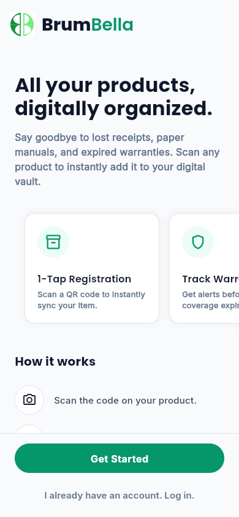
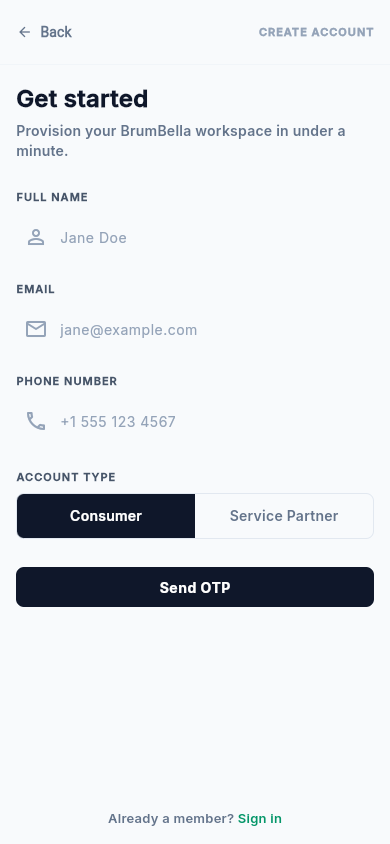
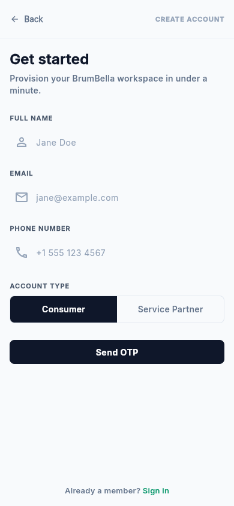
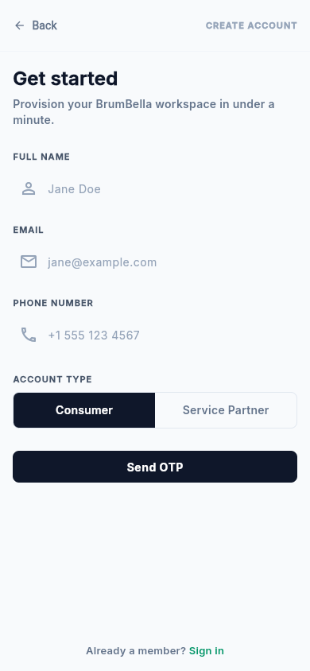
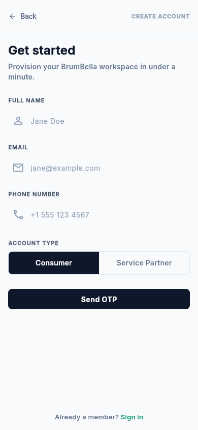

# BrumBella | Unified Digital Warranty & Service Management

> One SaaS platform connecting customers, enterprises, and developers through a single intelligent cloud.

This Flutter mobile application serves as the universal digital layer, replacing physical warranty cards, manuals, and service history.

## Technical Stack & Scope

This application is built using **Flutter** and **Dart**.

> [!IMPORTANT]
> **Scope Note:** This current iteration is a Phase 1 Frontend/UI-only deliverable. It utilizes local state management and mocked data to simulate enterprise functionality without a live backend connection.

## Key Features

- **Asset Registration:** Simulated QR/NFC optical scanning interface with manual serial fallback.
- **RAG-Powered Support Copilot:** AI diagnostics console interface for semantic retrieval of digital manuals.
- **Operational Telemetry:** Real-time dashboard grid displaying active warranties, open service tickets, and inventory maps.
- **After-Sales Marketplace:** Segmented routing for OEM spare parts, service partners, and extended coverage.
- **Dynamic Category Filtering:** Real-time sorting of registered assets by technical segments (Medical & Health, Wearables, etc.).

## Visuals

Here is a preview of the completed Enterprise B2B UI screens:

### Landing & Copilot Screen
<p float="left">
  
   
</p>

### Dashboard Home & Marketplace
<p float="left">
  
  
</p>

### Settings & Configuration
<p float="left">
  
</p>

## Enterprise Design System

The UI/UX architecture is built on a strict enterprise B2B design philosophy:

- **Typography:** Dual-font system utilizing `GoogleFonts.manrope()` for sharp, geometric headings and `GoogleFonts.inter()` for dense telemetry data.
- **Geometry:** Flat, shadowless architecture relying on 1px borders (`Color(0xFFE2E8F0)`) and strict 8px border radii.
- **Color Palette:** Monochromatic slate base (Slate 900 to Slate 50) accented strictly with brand Emerald Green (`Color(0xFF059669)`).

## Getting Started

To run this project locally, clone the repository and execute the following terminal commands:

```bash
flutter clean
flutter pub get
flutter run
```
