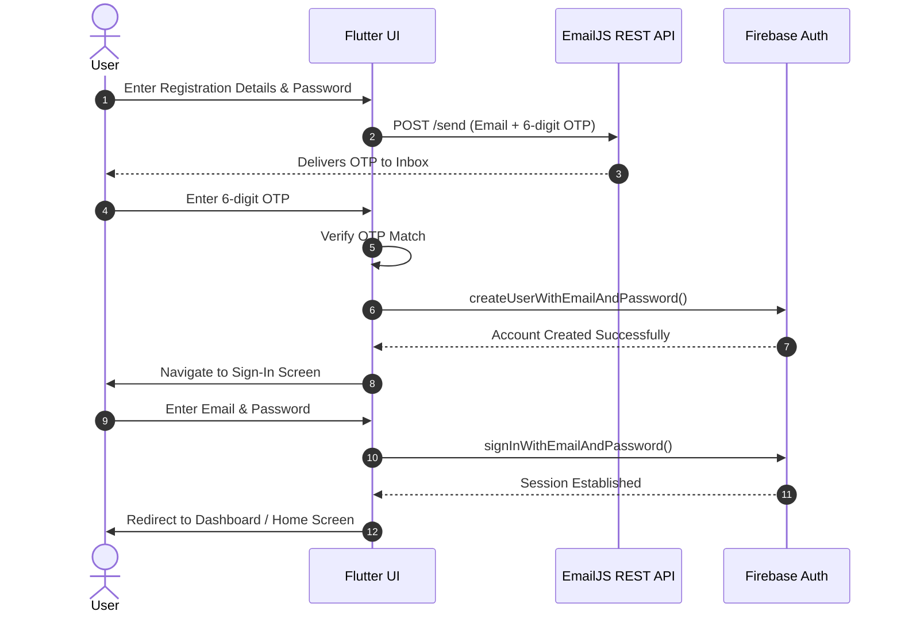

# Brumbella

## Project Overview
Brumbella is a clean, responsive Flutter replica of an enterprise SaaS platform layout. It provides a highly polished UI for managing assets across categories such as Home Appliances, Consumer Electronics, Medical & Health, and more. The application features a robust authentication flow tailored for Flutter Web to circumvent strict browser network limitations.

## Tech Stack
* **Frontend**: Flutter Web
* **Authentication**: Firebase Authentication
* **Email OTP Relay**: EmailJS REST API
* **State Management & UI**: Flutter built-in state, Material 3, Google Fonts

## Authentication Architecture & UI Flow

Because modern web browsers strictly prohibit raw TCP socket connections (which traditional native SMTP packages require), Brumbella utilizes an HTTP REST architecture via EmailJS to safely bridge email verification logic on the web.

### 1. Registration UI (`RegisterScreen`)
The user enters their details (Full Name, Email, Phone Number, Password, and Confirm Password) and selects an Account Type (Consumer / Service Partner).

### 2. OTP Dispatch (EmailJS API)
Upon clicking "Send OTP to Email", the application generates a random 6-digit verification code. It then fires a standard `application/json` HTTP POST request to the EmailJS REST API (`https://api.emailjs.com/api/v1.0/email/send`) with the necessary template parameters. EmailJS securely delivers the OTP code to the user's inbox without triggering browser CORS or Socket errors.

### 3. Email Verification UI (`OtpVerificationScreen`)
The user enters the 6-digit code received in their email. The application instantly validates it locally against the generated token that was passed directly through the Navigator route.

### 4. Firebase Account Creation
Upon a successful OTP match, the app invokes `FirebaseAuth.instance.createUserWithEmailAndPassword()` to securely register and encrypt the user's credentials in the backend Firebase Authentication database.

### 5. Sign-In UI (`LoginScreen`)
The user is routed to the login page where they input their Email ID and Password. The app securely validates these credentials using `FirebaseAuth.instance.signInWithEmailAndPassword()`.

### 6. Post-Login Routing
Once the user's session is established, the application replaces the current route stack and redirects the user to the main authenticated `DashboardShell` (Home Screen).

---

## Authentication Sequence Diagram

